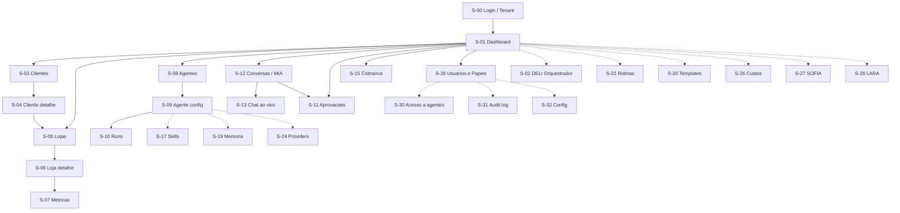

# 🖥️ T3 — Mapa de Telas · Console Interno (rascunho v0)

> **Pra você marcar e mudar ANTES de codar.** Isto é proposta, não decisão. Risca, renomeia, move, corta — é justamente pra ajustar barato agora.
> Vive no repo + Obsidian (igual ao Mapa Vivo).

**Decisões desta track:** persona = **console interno** (time CD opera os clientes) · fidelidade = **mista** (estrutura do paradigma EvoNexus, telas-chave redesenhadas pro domínio CD).

**Legenda de prioridade:** 🟢 MVP · 🟡 V2 · 🔵 V3+

---

## 🗺️ Mapa de navegação

*(linha cheia = fluxo MVP · linha pontilhada = telas V2/V3)*

---

## 📋 Inventário de telas

### 0. Acesso
- **S-00 · Login / Seleção de tenant** 🟢
  Login + (se multi-tenant) escolher qual cliente operar. Define o contexto de tenant pro resto da sessão.

### 1. Núcleo / Orquestração *(oracle → DELI)*
- **S-01 · Dashboard** 🟢
  Home do operador. KPIs da plataforma, clientes ativos, agentes rodando agora, **fila de aprovações pendentes** em destaque, alertas (churn, inadimplência, erro de agente).
- **S-02 · DELI — Orquestrador** 🟡
  O que o DELI está coordenando: fila de tarefas, handoffs entre agentes, decisões recentes.

### 2. Clientes & Lojas *(domínio CD)*
- **S-03 · Clientes (lista)** 🟢
  Clientes da CD. Status (`is_active`), tier (Light/Performance/Enterprise), flag de risco de churn. Filtro + busca.
- **S-04 · Cliente — detalhe** 🟢
  Dados, contrato/tier, lojas vinculadas, saúde da conta, histórico.
- **S-05 · Lojas (lista)** 🟢
  Todas as lojas (escopo por tenant). Canal (iFood/99Food/Rappi/Keeta/próprio), status, métrica-resumo.
- **S-06 · Loja — detalhe** 🟢
  Núcleo operacional da loja: consultores, vínculo WhatsApp, GPT da loja, child tables. Abas pra cada bloco.
- **S-07 · Métricas da loja** 🟡
  Gráficos (pedidos, ticket, evolução), snapshots históricos.

### 3. Agentes *(paradigma EvoNexus)*
- **S-08 · Agentes (catálogo)** 🟢
  DELI, CORA, MIA, Analista iFood, BomDia, Encerramento, LARA, SOFIA, BRENO. Status, modo (ia/híbrido), habilitação por tenant.
- **S-09 · Agente — config** 🟢
  Prompt/role, modo, tools habilitadas (RBAC), provider, custo, habilitação por tenant (`tenant_agents`/`tenant_agent_config`).
- **S-10 · Runs do agente** 🟢
  Histórico de execuções (`agent_runs`): tokens, custo, resultado, status, timestamp.
- **S-11 · Fila de aprovações (propõe-e-aprova)** 🟢
  Sugestões da IA aguardando humano (`sugestoes_ia`). Ações: aprovar · editar · rejeitar. Coração do modelo "agente propõe, humano aprova".

### 4. Conversas & Atendimento
- **S-12 · Monitor de conversas (MIA)** 🟢
  Conversas WhatsApp monitoradas, análise batch (15min), sinais/alertas. Só conversas vinculadas a `loja_id`.
- **S-13 · Chat ao vivo** 🟢
  Atendimento humano + agente (BomDia/Encerramento). Visão da conversa, assumir/devolver.

### 5. Cobrança *(CORA / Asaas)*
- **S-15 · Cobrança — visão geral** 🟢
  Faturas, status, inadimplência. CORA restrito por papel.
- **S-16 · Fatura — detalhe** 🟡

### 6. Skills *(paradigma)*
- **S-17 · Skills (lista)** 🟡 — skills disponíveis, por agente.
- **S-18 · Skill — editor** 🟡 — editar a skill (markdown-as-tool).

### 7. Memória *(paradigma)*
- **S-19 · Memória** 🟡 — ver/editar/limpar memória por agente e por tenant (`agent_memories`).

### 8. Templates *(paradigma)*
- **S-20 · Templates (lista)** 🟡 — mensagens e **ofertas** (nunca "promoção").
- **S-21 · Template — editor** 🟡

### 9. Rotinas / Automações *(paradigma → Trigger.dev)*
- **S-22 · Rotinas (lista)** 🟡 — BomDia, Encerramento, MIA 15min, drips. Status, próxima execução.
- **S-23 · Rotina — config** 🟡 — schedule, agente, condições.

### 10. Providers *(paradigma → multi-provider)*
- **S-24 · Providers (lista)** 🟡 — Claude, Ollama/Kimi, OpenRouter por tenant; Evolution, Asaas.
- **S-25 · Provider — config** 🟡 — key (via Infisical), base_url, modelo default.

### 11. Custos *(paradigma)*
- **S-26 · Custos** 🟡 — por tenant / agente / provider / período.

### 12. Prospecção & Marketing *(agentes futuros)*
- **S-27 · Prospecção (SOFIA)** 🔵 — pipeline, leads, ICP.
- **S-28 · Marketing & Conteúdo (LARA)** 🔵 — drips 90 dias, calendário CRM.

### 13. Administração / RBAC
- **S-29 · Usuários & papéis** 🟢 — RBAC (7 papéis: admin, dev, marketing, atendimento, financeiro, viewer, deli_owner).
- **S-30 · Acesso a agentes** 🟡 — `user_agent_access`.
- **S-31 · Audit log** 🟡 — `audit_log`.
- **S-32 · Config da plataforma/tenant** 🟡 — `is_active`, settings, white-label (V3).

---

## 🎯 Shortlist MVP (🟢 — o que o time CD precisa pra operar já)

`S-00 Login` · `S-01 Dashboard` · `S-03 Clientes` · `S-04 Cliente detalhe` · `S-05 Lojas` · `S-06 Loja detalhe` · `S-08 Agentes` · `S-09 Agente config` · `S-10 Runs` · `S-11 Aprovações` · `S-12 MIA` · `S-13 Chat ao vivo` · `S-15 Cobrança` · `S-29 Usuários & papéis`

≈ 14 telas. Sugestão de possível merge: **S-11** (aprovações) e a aba de sugestões dentro de **S-12** podem ser a mesma fila filtrada — decidir no protótipo.

---

## ▶️ Próximo passo

Quando você revisar e ajustar este mapa, a **T3(b)** é o **protótipo clicável em React** das 14 telas do MVP — com dados fake, navegável, pra você ver layout/botão/cor e mudar antes de qualquer código ou banco. Aí sim vira o esqueleto real depois.
