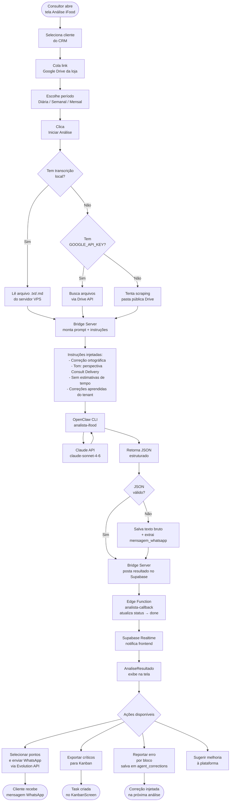

# Fluxo — Módulo Análise iFood

## Tabela de responsabilidades

| Etapa | Onde acontece | Arquivo principal |
|---|---|---|
| Formulário | Frontend (Lovable) | `src/screens/AnaliseiFoodScreen.jsx` |
| Disparo do job | Frontend → Bridge via HTTP | `src/screens/AnaliseiFoodScreen.jsx` |
| Busca de dados | Bridge Server | `.openclaw/bridge-server/index.js` |
| Execução do agente | VPS / OpenClaw | agente `analista-ifood` |
| Callback de resultado | Edge Function | `supabase/functions/analista-callback/` |
| Exibição e ações | Frontend | `src/components/AnaliseResultado.jsx` |
| Correções aprendidas | Supabase `agent_corrections` | `src/components/AgenteFeedbackModal.jsx` |
