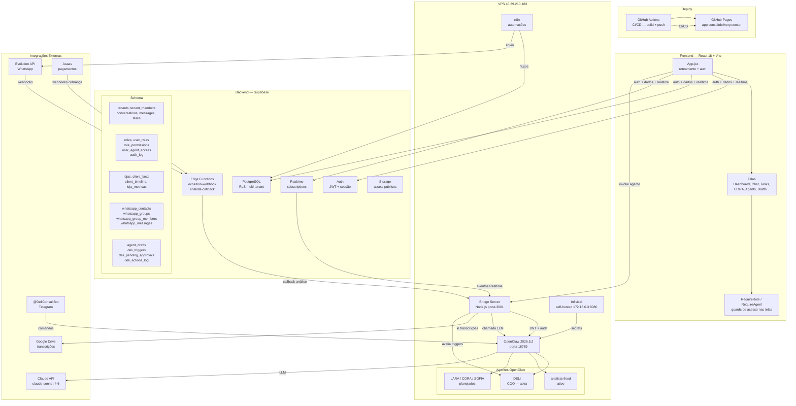

# Arquitetura da Stack — Consult Delivery

## Legenda

| Componente | Papel |
|---|---|
| React 18 + Vite | Interface SaaS multi-tenant |
| GitHub Actions → Pages | CI/CD + hospedagem (app.consultdelivery.com.br) |
| Supabase | BD, auth, realtime, edge functions, storage |
| Bridge Server | Intermediário HTTP entre Supabase e OpenClaw |
| OpenClaw | Runtime dos agentes IA (porta 18789) |
| Claude API | LLM base de todos os agentes |
| Evolution API | Envio/recebimento WhatsApp |
| n8n | Automações e integrações |
| Infisical | Cofre de secrets (self-hosted) |
| Asaas | Cobrança e pagamentos |
| @DeliConsultBot | Interface Telegram para comandos |
