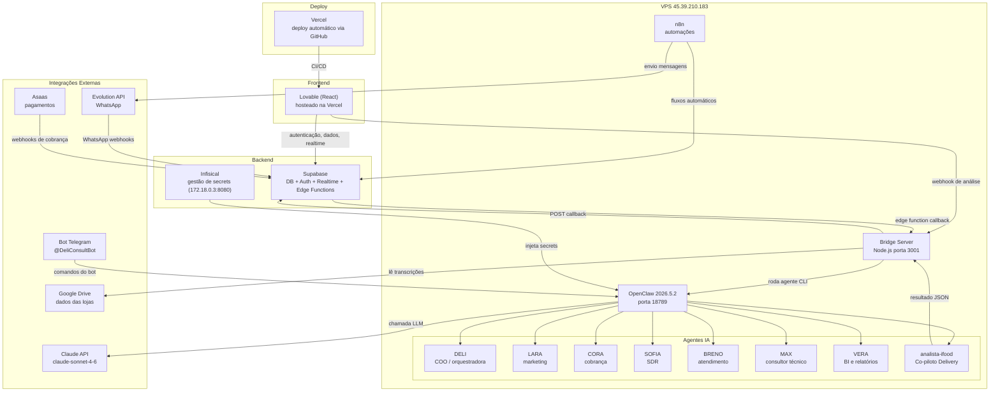

# Arquitetura da Stack — Consult Delivery

## Legenda

| Componente | Papel |
|---|---|
| Lovable + Vercel | Interface do usuário, deploy automático |
| Supabase | Banco de dados, autenticação, realtime, edge functions |
| Bridge Server | Intermediário HTTP entre Supabase e OpenClaw |
| OpenClaw | Runtime dos agentes IA (CLI, porta 18789) |
| Claude API | LLM subjacente a todos os agentes |
| Evolution API | Envio/recebimento de mensagens WhatsApp |
| n8n | Automações de fluxo (webhooks, integrações) |
| Infisical | Cofre de secrets do time (self-hosted) |
| Asaas | Cobrança e pagamentos dos clientes |
| @DeliConsultBot | Interface Telegram para disparar agentes |
