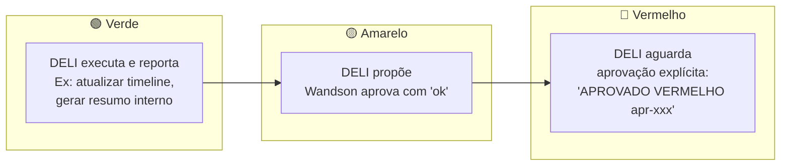
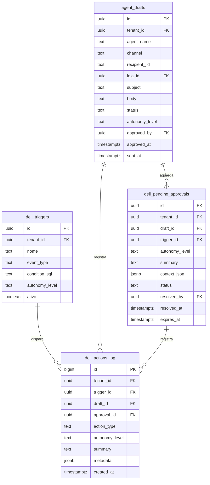
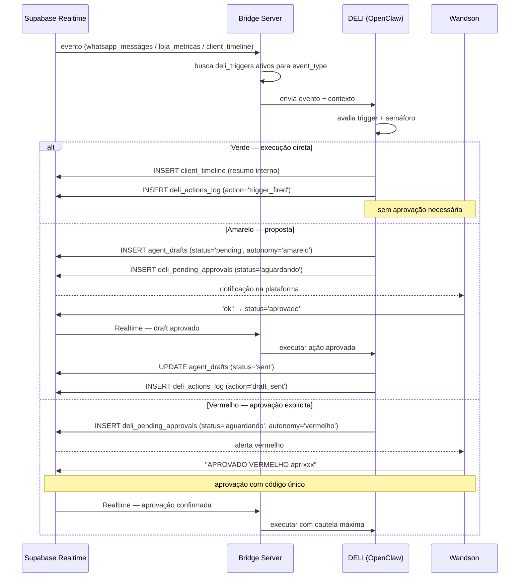

# DELI — COO Digital: Triggers, Semáforo e Drafts

## Identidade e papel

DELI é a COO digital da Consult Delivery. Monitora tudo, orquestra especialistas,
propõe ações com semáforo. **Nunca responde clientes diretamente.**

## Semáforo de autonomia

## Schema de tabelas

## Fluxo completo: evento → ação

## Triggers iniciais (seed)

| Trigger | event_type | Semáforo | Ação |
|---|---|---|---|
| Cliente sumiu 7 dias | mensagem_recebida | 🟢 Verde | notificar equipe internamente |
| Mensagem recebida | mensagem_recebida | 🟢 Verde | atualizar client_timeline |
| Métrica caiu 20%+ | metrica_caiu | 🟡 Amarelo | invocar analista-ifood + propor draft |
| Config OpenClaw alterada | config_alterada | 🔴 Vermelho | aguardar APROVADO VERMELHO |

## Canais de saída de drafts

| channel | Aprovação necessária | Destinatário |
|---|:---:|---|
| `whatsapp_group` | obrigatória | grupo da loja cliente |
| `whatsapp_pv` | obrigatória | cliente no privado |
| `telegram_interno` | não (verde passa direto) | canal interno da equipe |
| `painel` | não (verde passa direto) | DraftsPendentesScreen |
