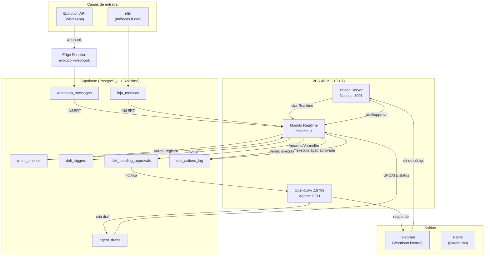
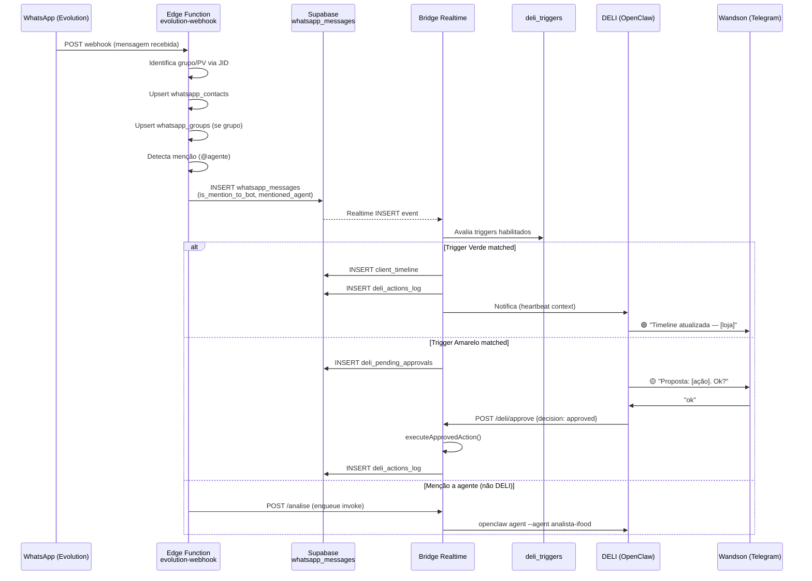
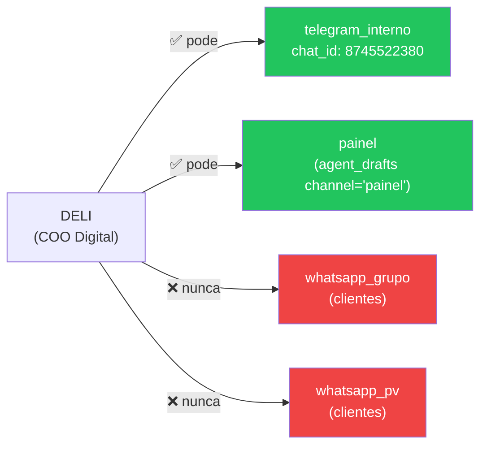
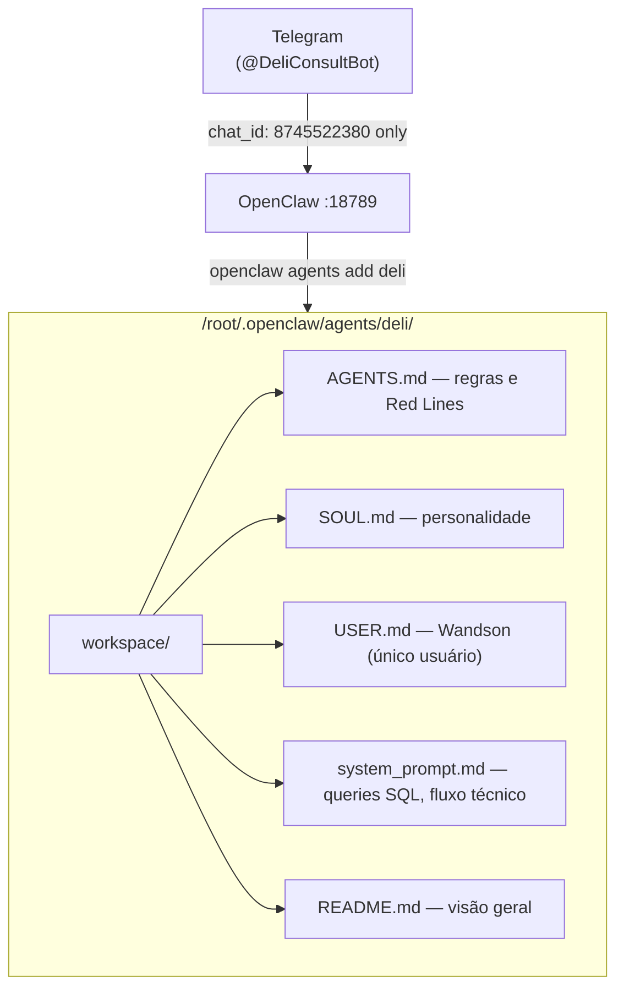

# DELI — Fluxo de Monitoramento e Autonomia

Diagramas do agente DELI: como escuta eventos, avalia triggers e age conforme o semáforo.

---

## 1. Arquitetura geral



---

## 2. Fluxo de mensagem WhatsApp recebida



---

## 3. Semáforo de autonomia DELI

```mermaid
flowchart LR
    EV[Evento detectado] --> AV{Avalia trigger}

    AV -->|autonomy_level = verde| VE[🟢 Verde]
    AV -->|autonomy_level = amarelo| AM[🟡 Amarelo]
    AV -->|autonomy_level = vermelho| VR[🔴 Vermelho]

    VE --> EX[Executa imediatamente]
    EX --> AL1[(deli_actions_log)]
    EX --> WD1[Notifica Wandson<br/>após execução]

    AM --> PA1[(deli_pending_approvals)]
    PA1 --> WD2[Wandson recebe proposta]
    WD2 -->|responde 'ok'| APR[/deli/approve]
    APR --> EX2[Executa ação]
    EX2 --> AL2[(deli_actions_log)]

    VR --> PA2[(deli_pending_approvals)]
    PA2 --> WD3[Wandson recebe alerta crítico]
    WD3 -->|responde 'APROVADO VERMELHO apr-xxx'| APR2[/deli/approve + código]
    APR2 --> EX3[Executa ação de alto impacto]
    EX3 --> AL3[(deli_actions_log)]

    style VE fill:#22c55e,color:#fff
    style AM fill:#f59e0b,color:#fff
    style VR fill:#ef4444,color:#fff
```

---

## 4. Restrição de canais DELI



---

## 5. Estrutura do agente DELI no OpenClaw



---

_Gerado em 04/05/2026. Atualizar quando novos triggers ou canais forem adicionados._
