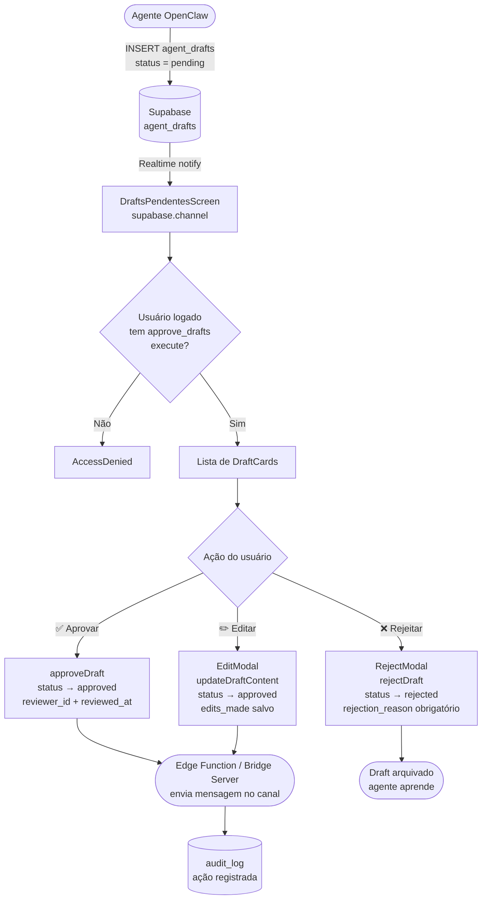

# Fluxo Drafts UI — Etapa 11

Descreve o ciclo completo de proposta-aprovação de mensagens dos agentes.

## Canais suportados

| Canal | Cor | Aprovação obrigatória? |
|---|---|---|
| `whatsapp_grupo` | Verde WhatsApp | ✅ Sim |
| `whatsapp_pv` | Verde escuro | ✅ Sim |
| `telegram_interno` | Azul Telegram | ❌ Direto (é para equipe) |
| `painel` | Vermelho CD | ❌ Direto (é para equipe) |

## Componentes envolvidos

- `src/screens/DraftsPendentesScreen.jsx` — tela principal
- `src/lib/api.js` — `listAgentDrafts`, `approveDraft`, `rejectDraft`, `updateDraftContent`, `subscribeToDrafts`
- `src/components/auth/RequireRole.jsx` — guard `approve_drafts:execute`
- `supabase/migrations/20260504_004_drafts_deli.sql` — schema `agent_drafts`