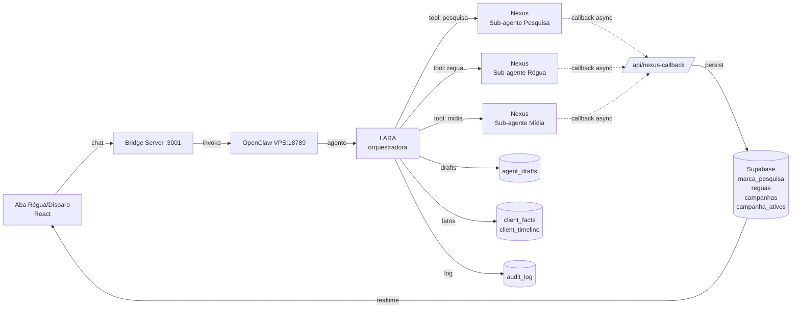
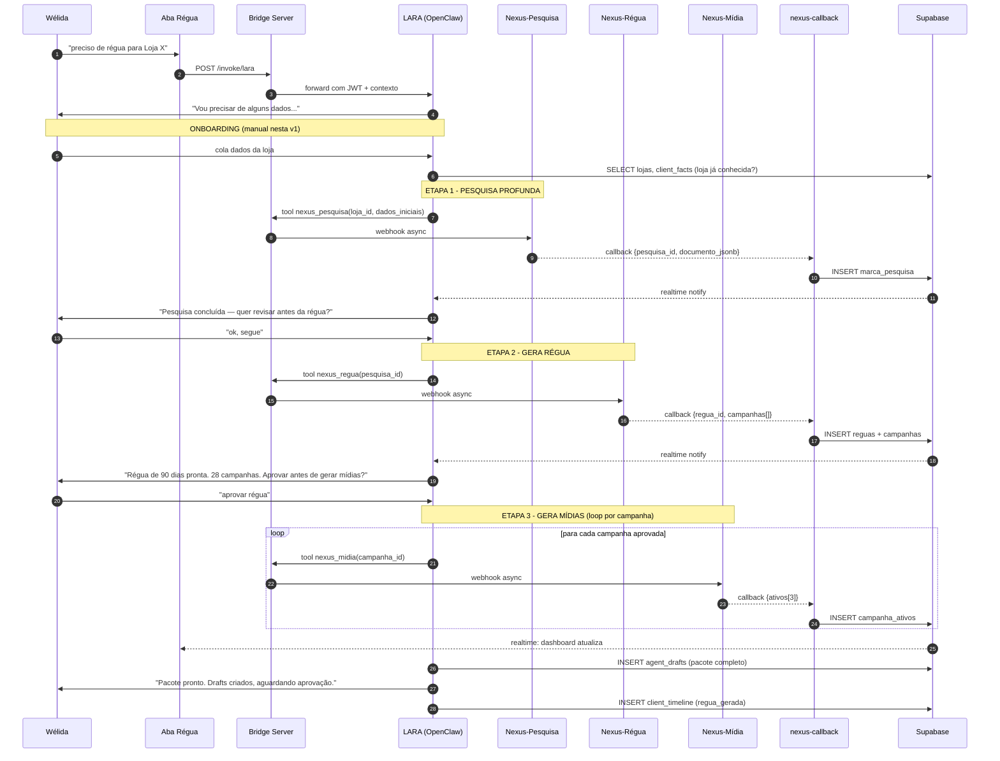
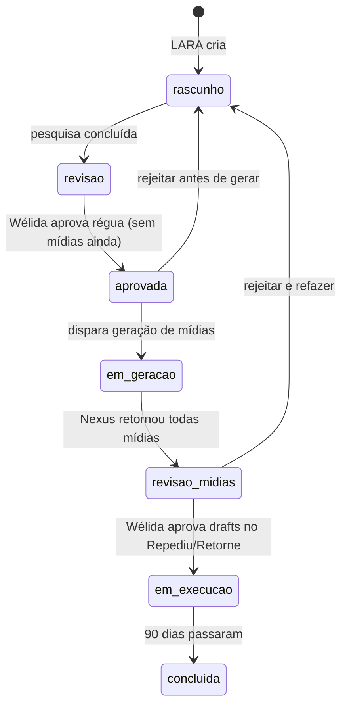

# Fluxo — LARA Agente Régua de Disparo

> Documento de arquitetura da LARA (especialista em CRM food service e régua de disparo).
> Localização do agente: OpenClaw 2026.5.2 — VPS 187.127.25.24:18789
> Versão: 1.0 — 06/05/2026

---

## 1. Visão geral (alto nível)

---

## 2. Sequência detalhada — geração de régua nova

---

## 3. Estados da Régua

---

## 4. Comunicação LARA ↔ Nexus (assíncrona)

| Etapa | Tool LARA chama | Endpoint Nexus | Callback recebe |
|---|---|---|---|
| Pesquisa | `nexus_pesquisa` | `POST {NEXUS_BASE}/agents/pesquisa/run` | `marca_pesquisa` salvo |
| Régua | `nexus_regua` | `POST {NEXUS_BASE}/agents/regua/run` | `reguas` + `campanhas` salvos |
| Mídia (1 por campanha) | `nexus_midia` | `POST {NEXUS_BASE}/agents/midia/run` | `campanha_ativos` (3 variações) salvo |

**Webhook único de retorno:** `https://app.consultdelivery.com.br/api/nexus-callback`

**Autenticação do callback:** header `X-Nexus-Signature` (HMAC-SHA256 com secret compartilhado, armazenado no Infisical).

---

## 5. Permissões (RBAC)

| Papel | lara:invoke | lara:approve_drafts |
|---|:---:|:---:|
| admin | ✅ | ✅ |
| marketing (Wélida) | ✅ | ✅ |
| atendimento | | |
| dev | | |
| financeiro | | |

Configurado em `user_agent_access` (vide `supabase/migrations/20260504_001_rbac.sql`).

---

## 6. Memória da LARA

| Camada | Onde vive | Conteúdo |
|---|---|---|
| Curto prazo (sessão) | OpenClaw context window | Conversa atual com a Wélida |
| Médio prazo (cliente) | `client_facts` + `client_timeline` | Fatos sobre a loja (tom de voz, produto carro-chefe, sazonalidade) |
| Longo prazo (régua) | `marca_pesquisa` + `reguas` + `campanhas` + `campanha_ativos` | Pesquisa profunda + régua estruturada + mídias |
| Aprendizado entre lojas | `client_facts` com `category='lara_aprendizados'` | O que funcionou bem em outras lojas (heurísticas) |

LARA SEMPRE consulta `client_facts` ANTES de iniciar onboarding — se a loja já existe, não pede dados que já tem.

---

## 7. Pontos de falha conhecidos e mitigação

| Risco | Mitigação |
|---|---|
| Nexus demora muito (>5min) | Callback assíncrono. LARA avisa "Nexus está processando, te aviso quando terminar." |
| Imagem da Mídia volta com produto que não é o da loja | Validação no callback: comparar `produto_destaque` da campanha vs alt-text/metadados da imagem |
| 30 campanhas × 3 mídias = 90 imagens (custo alto) | Pausa obrigatória em "régua aprovada" antes de gerar mídias. Wélida pode reduzir escopo |
| Wélida aprovou régua mas Nexus está fora do ar | Estado `em_geracao` + retry com backoff exponencial (3 tentativas) |
| Alucinação em CNPJ ou dados de contato | Regra de prompt: "se dado não foi fornecido, escreve 'dado não coletado'. NUNCA inventa." |

---

*Documento gerado em 06/05/2026. Atualizar quando arquitetura mudar.*
