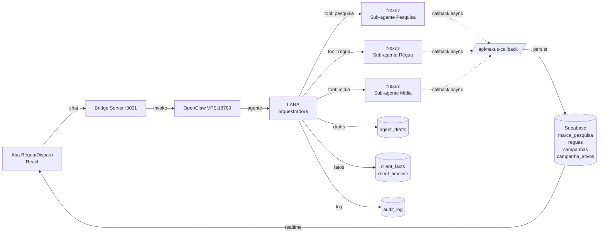
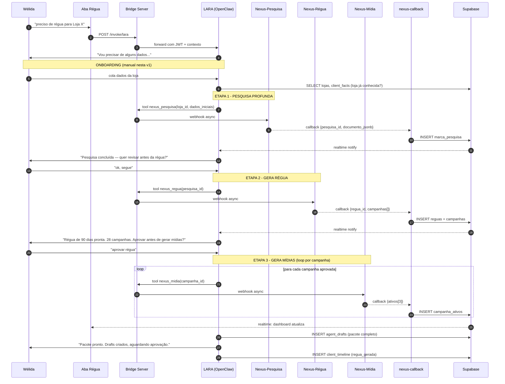
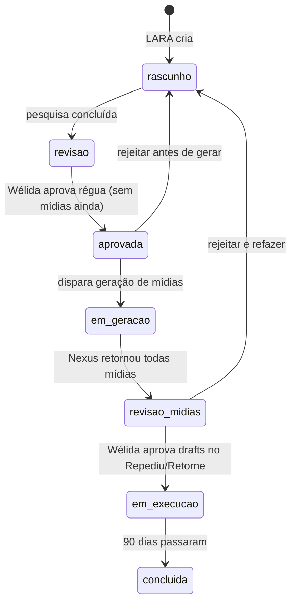
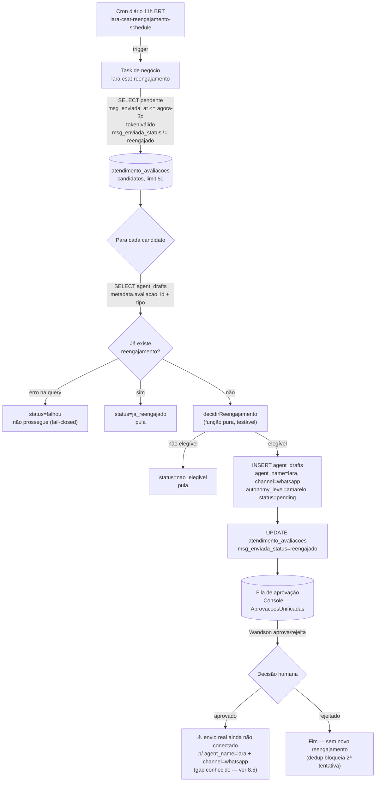

# Fluxo — LARA Agente Régua de Disparo

> Documento de arquitetura da LARA (especialista em CRM food service e régua de disparo).
> Localização do agente: OpenClaw 2026.5.2 — VPS 187.127.25.24:18789
> Versão: 1.0 — 06/05/2026

---

## 1. Visão geral (alto nível)

---

## 2. Sequência detalhada — geração de régua nova

---

## 3. Estados da Régua

---

## 4. Comunicação LARA ↔ Nexus (assíncrona)

| Etapa | Tool LARA chama | Endpoint Nexus | Callback recebe |
|---|---|---|---|
| Pesquisa | `nexus_pesquisa` | `POST {NEXUS_BASE}/agents/pesquisa/run` | `marca_pesquisa` salvo |
| Régua | `nexus_regua` | `POST {NEXUS_BASE}/agents/regua/run` | `reguas` + `campanhas` salvos |
| Mídia (1 por campanha) | `nexus_midia` | `POST {NEXUS_BASE}/agents/midia/run` | `campanha_ativos` (3 variações) salvo |

**Webhook único de retorno:** `https://app.consultdelivery.com.br/api/nexus-callback`

**Autenticação do callback:** header `X-Nexus-Signature` (HMAC-SHA256 com secret compartilhado, armazenado no Infisical).

---

## 5. Permissões (RBAC)

| Papel | lara:invoke | lara:approve_drafts |
|---|:---:|:---:|
| admin | ✅ | ✅ |
| marketing (Wélida) | ✅ | ✅ |
| atendimento | | |
| dev | | |
| financeiro | | |

Configurado em `user_agent_access` (vide `supabase/migrations/20260504_001_rbac.sql`).

---

## 6. Memória da LARA

| Camada | Onde vive | Conteúdo |
|---|---|---|
| Curto prazo (sessão) | OpenClaw context window | Conversa atual com a Wélida |
| Médio prazo (cliente) | `client_facts` + `client_timeline` | Fatos sobre a loja (tom de voz, produto carro-chefe, sazonalidade) |
| Longo prazo (régua) | `marca_pesquisa` + `reguas` + `campanhas` + `campanha_ativos` | Pesquisa profunda + régua estruturada + mídias |
| Aprendizado entre lojas | `client_facts` com `category='lara_aprendizados'` | O que funcionou bem em outras lojas (heurísticas) |

LARA SEMPRE consulta `client_facts` ANTES de iniciar onboarding — se a loja já existe, não pede dados que já tem.

---

## 7. Pontos de falha conhecidos e mitigação

| Risco | Mitigação |
|---|---|
| Nexus demora muito (>5min) | Callback assíncrono. LARA avisa "Nexus está processando, te aviso quando terminar." |
| Imagem da Mídia volta com produto que não é o da loja | Validação no callback: comparar `produto_destaque` da campanha vs alt-text/metadados da imagem |
| 30 campanhas × 3 mídias = 90 imagens (custo alto) | Pausa obrigatória em "régua aprovada" antes de gerar mídias. Wélida pode reduzir escopo |
| Wélida aprovou régua mas Nexus está fora do ar | Estado `em_geracao` + retry com backoff exponencial (3 tentativas) |
| Alucinação em CNPJ ou dados de contato | Regra de prompt: "se dado não foi fornecido, escreve 'dado não coletado'. NUNCA inventa." |

---

## 8. Régua de Reengajamento CSAT (2026-07)

> **Pipeline distinto do fluxo de campanhas de marketing (seções 1-7 acima).** Aquele é
> o fluxo legado LARA↔OpenClaw/Nexus (arquitetura descontinuada — OpenClaw é só POC,
> ver `CLAUDE.md` §STACK "Em avaliação"). Este é o pipeline **ativo**: Trigger.dev puro,
> sem OpenClaw/Nexus, focado em reengajar clientes que receberam a pesquisa CSAT
> pós-atendimento e não responderam. PR #775.

### 8.1 Contexto

QA da leva 4 (05/07) detectou taxa de resposta CSAT de 3% (32 respostas) na Karina
Doceria. A régua varre `atendimento_avaliacoes` pendentes há ≥3 dias e gera **1 draft de
lembrete por pesquisa** — nunca reenvia sozinha (DRAFTS/`CLAUDE.md`: "nenhum agente
envia mensagem a cliente sem aprovação").

### 8.2 Fluxo (detecção → draft → aprovação)

### 8.3 Regras de elegibilidade (`decidirReengajamento`)

| Condição | Resultado |
|---|---|
| `status != 'pendente'` (já respondida ou expirada) | não cria |
| `public_token_expires_at <= agora` (link morto) | não cria |
| `msg_enviada_at` nulo (nunca enviada) | não cria |
| enviada há menos de 3 dias | não cria (`dentro_do_prazo`) |
| `msg_enviada_status = 'reengajado'` OU já existe draft de reengajamento p/ essa avaliação | não cria (dedup — máx. 1 por pesquisa) |
| nenhuma das anteriores | cria draft |

### 8.4 Anti-starvation (fix pós-review, PR #775)

A primeira versão usava `order(msg_enviada_at asc) + limit(50)` com dedup só em memória
(consulta a `agent_drafts` por avaliação). Em volume alto (~1000 pendentes na Karina),
isso causava **starvation**: as mesmas 50 linhas mais antigas voltavam todo dia como
`ja_reengajado` e o resto da fila nunca era varrido. Fix: ao criar o draft, a própria
linha de `atendimento_avaliacoes` é marcada (`msg_enviada_status='reengajado'`) e a
query fonte passa a **excluir** (`.neq`) essas linhas — a janela avança a cada execução.
O dedup via `agent_drafts` virou apenas retry-safety-net (cobre o caso raro de a
marcação da linha falhar depois do draft já ter sido criado).

### 8.5 Gap conhecido — envio pós-aprovação

`src/console/AprovacoesUnificadas.jsx` só dispara envio real ao aprovar drafts de
`agent_name='gestor'`, `operacao.startsWith('ifood.')` ou
`channel='whatsapp' AND agent_name='breno'`. Para `agent_name='lara' + channel='whatsapp'`
(este fluxo), aprovar hoje só marca `status='approved'` — **a mensagem não sai**.
Resolver exige decidir o canal por registro (`origem='interno'` → Evolution via
`contact_identifier`; `origem='crm_externo'` → DataCrazy via `contact_identifier=conv.id`,
como em `sendDatacrazyCsatMessage` no poller). Escopo de PR futuro.

### 8.6 Arquivos

| Arquivo | Papel |
|---|---|
| `trigger/lara/csat-reengajamento.ts` | `laraCsatReengajamentoSchedule` (cron) + `laraCsatReengajamento` (task de negócio) + `decidirReengajamento` (função pura) |
| `trigger/lara/csat-reengajamento.test.ts` | Testes offline da detecção/dedup/mensagem |
| `supabase/migrations/00000000000000_baseline.sql` | Colunas usadas: `atendimento_avaliacoes.msg_enviada_status/msg_enviada_at/public_token_expires_at`, `agent_drafts.metadata` |

---

*Documento gerado em 06/05/2026. Seção 8 adicionada em 06/07/2026. Atualizar quando arquitetura mudar.*
