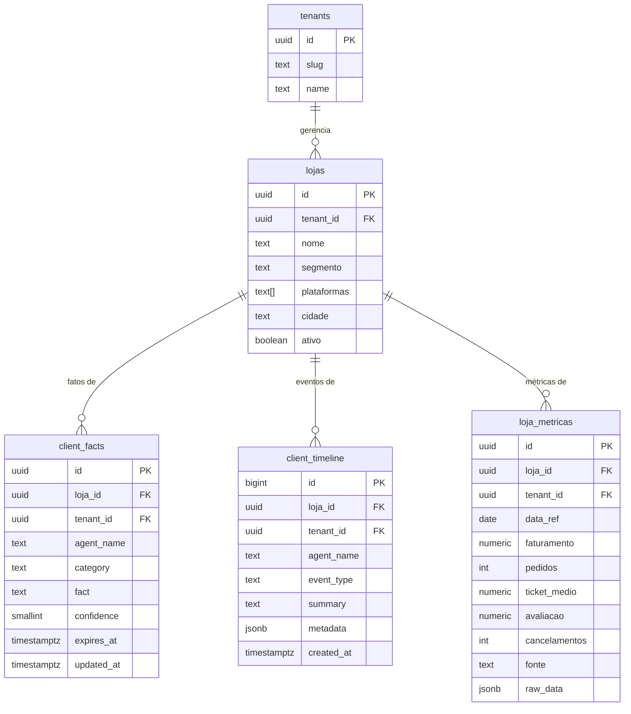
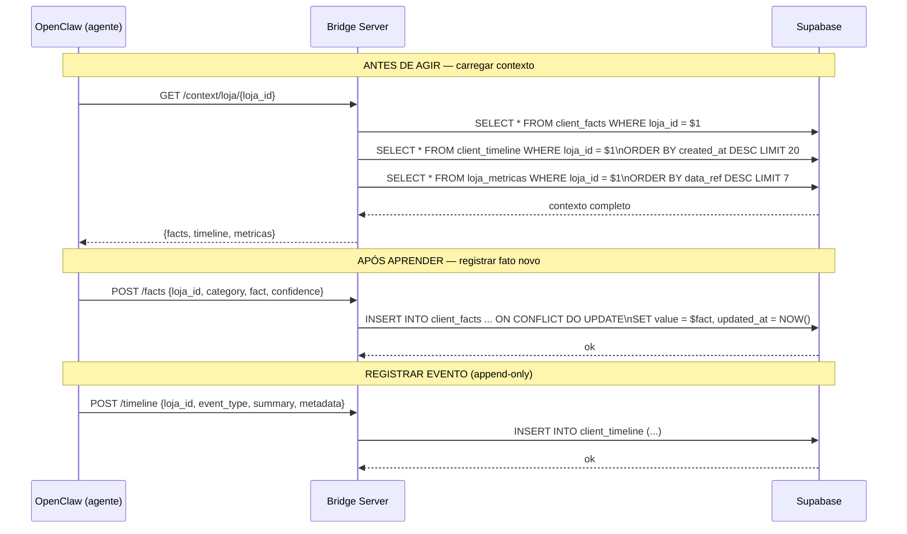

# Memória Central dos Agentes

Fatos sobre clientes vivem no **Supabase**, não em `memory/*.md` na VPS.
Qualquer agente pode ler e escrever. A memória é compartilhada entre DELI, analista-ifood, CORA, etc.

## Schema de tabelas

## Fluxo de leitura e escrita por agente

## Categorias de fatos (client_facts.category)

| Categoria | Exemplos |
|---|---|
| preferencia | "prefere contato no WhatsApp", "não aceita ligações" |
| restricao | "sem orçamento para tráfego pago", "marca regional" |
| historico | "foi cliente da concorrente X por 2 anos" |
| objetivo | "meta de 200 pedidos/dia em 3 meses" |
| risco | "dono cogitou fechar loja em jan/2026" |

## Tipos de evento (client_timeline.event_type)

| event_type | Criado por |
|---|---|
| analise | analista-ifood |
| cobranca | CORA |
| mensagem | evolution-webhook |
| reuniao | equipe (manual) |
| meta | DELI |
| alerta | DELI / n8n |
