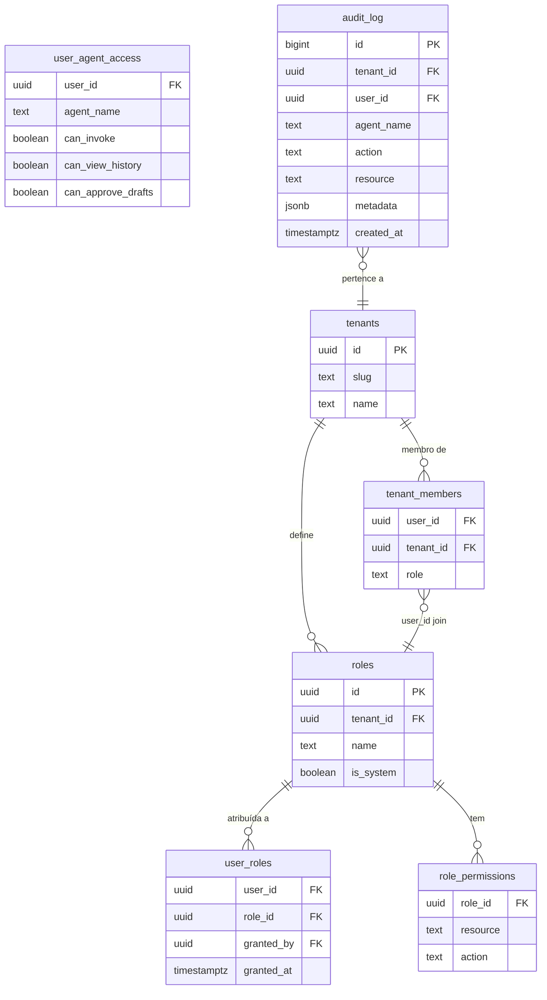
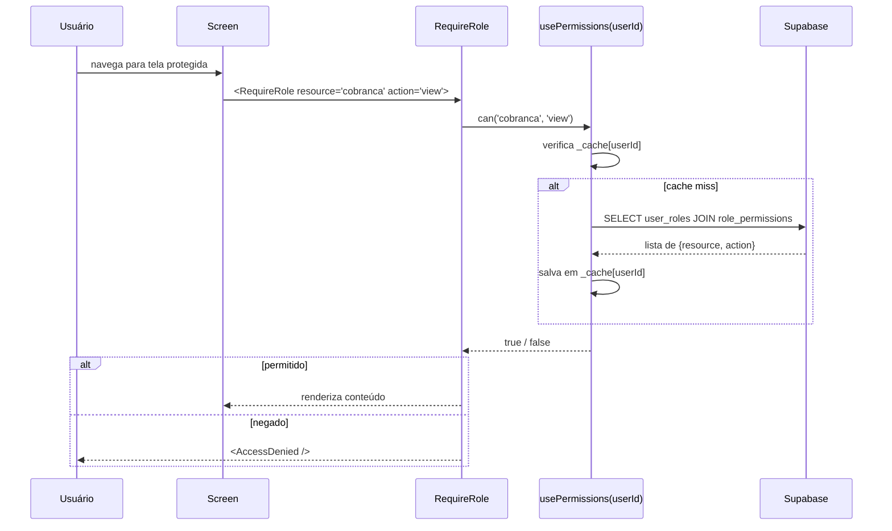
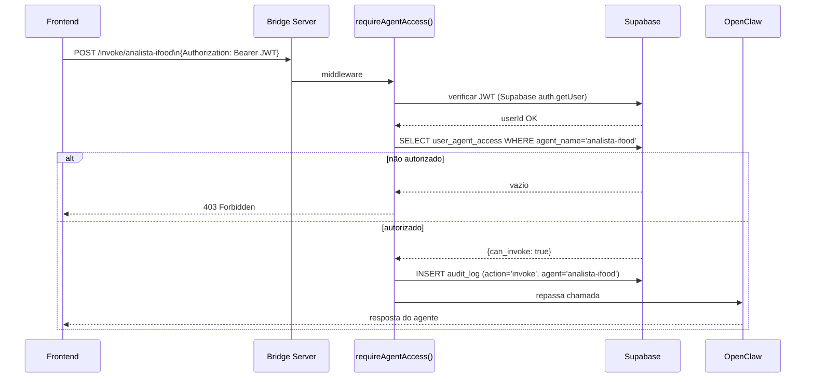

# RBAC — Papéis, Permissões e Fluxo de Autorização

## Schema de tabelas

## Fluxo de autorização React

## Fluxo de autorização Bridge Server (invoke agente)

## Matriz de permissões (seed)

| Resource | admin | dev | marketing | atendimento | financeiro | viewer | deli_owner |
|---|:---:|:---:|:---:|:---:|:---:|:---:|:---:|
| chat:view | ✅ | ✅ | ✅ | ✅ | | ✅ | |
| kanban:view | ✅ | ✅ | ✅ | ✅ | | ✅ | |
| kanban:create | ✅ | ✅ | ✅ | ✅ | | | |
| crm:view | ✅ | ✅ | ✅ | | | ✅ | |
| reports:view | ✅ | ✅ | ✅ | | | ✅ | |
| cobranca:view | ✅ | | | | ✅ | | |
| analise_ifood:view | ✅ | ✅ | | ✅ | | | |
| agents_panel:view | ✅ | ✅ | | | | | ✅ |
| tenant_admin:view | ✅ | | | | | | |
| deli:invoke | ✅ | | | | | | ✅ |
| approve_drafts:execute | ✅ | | | | | | ✅ |
