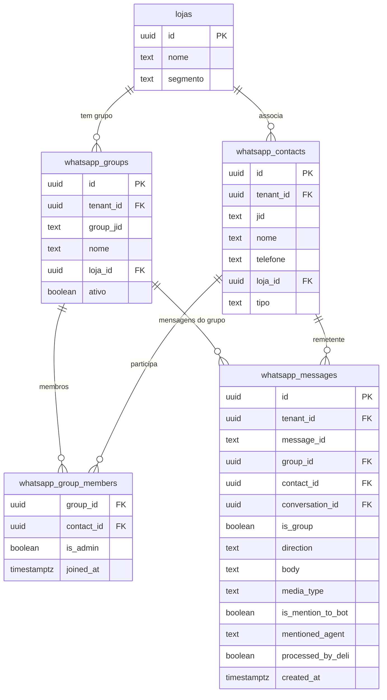
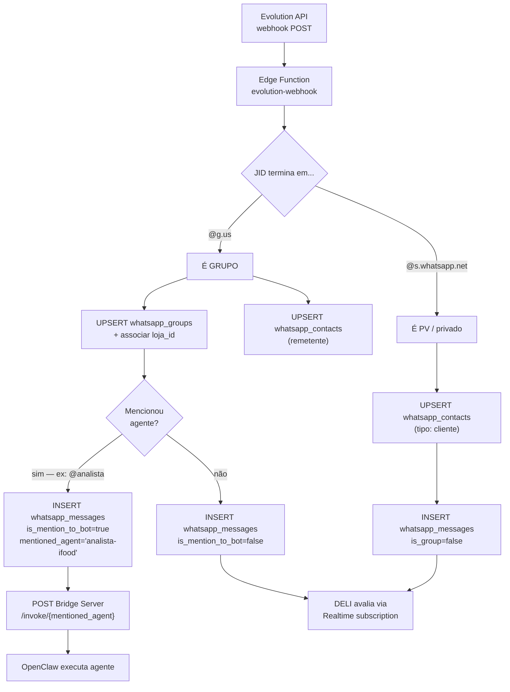

# Modelo WhatsApp — Contacts, Groups, Messages

## Regras de negócio

- 1 número oficial Evolution API por tenant
- 1 grupo por loja cliente (ex: "Consultoria - Pizza do Zé")
- PVs: clientes que chamam diretamente no privado
- Múltiplos remetentes num grupo: dono, sócios, gerentes, equipe Consult Delivery
- **DELI monitora tudo, mas NUNCA responde grupos ou PVs de cliente**
- Agentes só agem quando são **@mencionados** (ex: `@analista faz análise`)
- Resumos internos: `@DELI resume últimos 3 dias` → vai para canal interno da equipe

## Schema de tabelas

## Fluxo do evolution-webhook

## JID — identificadores WhatsApp

| Formato | Tipo | Exemplo |
|---|---|---|
| `55119...@s.whatsapp.net` | Contato individual / PV | cliente no privado |
| `5511999...@g.us` | Grupo | grupo da loja |
| `55119...@broadcast` | Lista de transmissão | (não tratado atualmente) |
