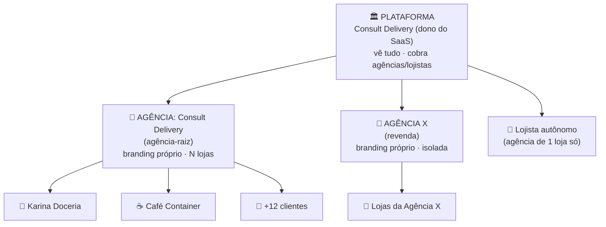

# Estudo — Estrutura de Tenancy da Plataforma Consult Delivery

**Data:** 2026-07-01 · **Status:** estudo (para decisão do Wandson) · **Autor:** sessão orquestradora

---

## 1. As perguntas que este estudo responde

O Wandson colocou 3 dúvidas, hoje que a Consult Delivery é uma **agência de consultoria com ~14 clientes ativos**:

1. **Um tenant por loja, ou uma plataforma única onde eu atendo todos os clientes dentro dela?**
2. **Preciso de um painel/portal para controlar todos os tenants e as telas que cada tenant acessa?**
3. **A plataforma vai ser revendida** — para (a) **outras agências de consultoria** e (b) **lojistas que querem a própria gestão**. Qual o melhor cenário?

**Veredito rápido (detalhado nas seções 4–6):**
- Q1 → **Um tenant por loja/cliente.** Sempre. Juntar tudo num tenant só quebra isolamento, LGPD, branding e inviabiliza a revenda. Você já faz isso — está certo.
- Q2 → **Sim, e você já tem o embrião** (`Clientes.jsx` + `tenant_modules`). Falta evoluir para um portal com camada de agência.
- Q3 → O gargalo da revenda é a **hierarquia**, que **hoje não existe**. Recomendo o **modelo de 3 níveis** (Plataforma → Agência → Loja) que unifica os três cenários num só desenho.

---

## 2. Diagnóstico — o que a plataforma JÁ tem (com evidência)

Antes da recomendação, o retrato fiel do estado atual (mapeado no código):

| Capacidade | Estado hoje | Evidência |
|---|---|---|
| **Isolamento por tenant** | ✅ `tenant_id` + RLS em todas as tabelas de dados | `20260504_001_rbac.sql`, `20260622_010_tenant_modules.sql` |
| **Como a RLS acha o tenant** | Lookup em `tenant_members` via `auth.uid()` (NÃO por JWT claim) | `tenant_id IN (SELECT tenant_id FROM tenant_members WHERE user_id = auth.uid())` |
| **1 usuário → N tenants** | ⚠️ Schema permite; switcher existe mas **latente** | `useTenants` + `<select>` em `ConsoleV2.jsx:260-290,906-913`; mas `App.jsx:94` usa `.maybeSingle()` (assume 1) |
| **Super-admin (ver todos os tenants)** | ✅ Embrião: é **uma tela**, não um portal | `src/console/Clientes.jsx` — lista todos os tenants, cria, billing Asaas R$147, toggle agente |
| **Gating de telas por tenant** | ✅ `tenant_modules` (allowlist de módulos) | `20260622_010_tenant_modules.sql`; sem linhas = **vê tudo (fail-open)** |
| **RBAC fino por usuário** | ✅ `roles`/`user_roles`/`role_permissions` + telas | `usePermissions.js`, `Configuracoes.jsx` |
| **Branding por tenant** | 🟡 Parcial: cor + logo nas telas **públicas** e no tema | `Marca.jsx`, `useBranding` (`ConsoleV2.jsx:315`); header do console = logo **fixo** "Consult Delivery" |
| **Domínio/subdomínio próprio** | ❌ Não existe | zero matches para `subdomain`/`custom domain` em `src/` |
| **Hierarquia (agência → lojas)** | ❌ **Não existe** | `tenants` é flat; sem `parent_tenant_id`/`agency_id` (`database.ts:953` `Relationships: []`) |
| **Catálogo de planos / assinatura da plataforma** | ❌ Não existe | `tenants.plan` é texto solto; assinatura R$147 é hardcoded em `Clientes.jsx:108` |

**Resumo do diagnóstico:** a base multi-tenant é sólida e correta (isolamento por dado + RLS). O que falta para os **3 cenários de revenda** é **uma camada de agrupamento acima do tenant** (hierarquia), **white-label completo** (logo no header + domínio) e um **motor de planos/assinatura**.

---

## 3. Conceitos de tenancy (mapa mental rápido)

Dois eixos que definem qualquer SaaS multi-cliente:

- **Isolamento** — *silo* (banco/schema por cliente) vs *pool* (tabelas compartilhadas + `tenant_id` + RLS). Você usa **pool**, que é o certo para dezenas/centenas de lojas (custo e manutenção baixos). Não mude isso.
- **Níveis de hierarquia** — *flat* (1 nível: tenant) vs *multi-level* (organização → tenant → …). Você está em **flat**. A revenda **exige multi-level**.

O ponto central deste estudo é o **segundo eixo**.

---

## 4. As contas/personas do seu negócio

A revenda cria 4 tipos de "conta" que precisam coexistir:

| Persona | Quem é | O que enxerga | Exemplo |
|---|---|---|---|
| **Plataforma (nível 0)** | Você / Consult Delivery, dono do SaaS | **Tudo** — todas as agências e lojas; cobra as agências/lojistas | Wandson |
| **Agência (nível 1)** | Uma consultoria que revende | Só **as próprias lojas**; branding próprio; gerencia seus consultores | Consult Delivery (como agência-raiz), Agência X revendedora |
| **Loja / Tenant (nível 2)** | A loja final (o cliente da consultoria) | Só **os próprios dados** | Karina Doceria, Café Container |
| **Lojista autônomo** | Comprou a plataforma p/ gerir a própria loja, sem agência | Só a própria loja | Padaria que assina direto |

**Insight que simplifica tudo:** o **lojista autônomo é só um caso particular** — uma "agência" com **1 loja só** (ou uma loja pendurada direto na Plataforma). Ou seja, **os 3 cenários do Wandson são o MESMO modelo** com número de filhos e logins diferentes. Um desenho cobre todos.

---

## 5. Respondendo cada dúvida

### Q1 — Tenant por loja, ou tudo numa plataforma só?

**Tenant por loja. Sem exceção.** Por quê:
- **Isolamento/LGPD** — dados de uma loja nunca vazam para outra (é o que a RLS garante hoje).
- **Branding** — cada loja tem cor/logo nas páginas públicas de avaliação/NPS.
- **Billing** — cada loja pode ter plano/cobrança própria.
- **Revenda** — sem separação por tenant, é impossível vender/isolar por agência.

"Atender todos os clientes numa plataforma só" **não** significa juntar tudo num tenant — significa **você (consultor) transitar entre os tenants** por um switcher + visão de portfólio. Que é exatamente o próximo item.

### Q2 — Portal para controlar todos os tenants e as telas de cada um?

**Sim — e você já começou.** Duas peças já existem:
- **`Clientes.jsx`** ("Clientes da plataforma · ADMIN") — a visão que lista/cria todos os tenants.
- **`tenant_modules`** — o allowlist que decide **quais telas cada tenant vê** (foi assim que a Karina Doceria ganhou os módulos admin no commit recente).

O que falta para virar um **portal de verdade**:
1. Escopar essa visão por **agência** (hoje ela lista *todos* os tenants sem filtro — ok enquanto só existe você; quebra na revenda).
2. Um **editor visual de `tenant_modules`** (hoje habilitar módulo é rodar SQL/migration à mão, como na Karina).
3. Corrigir o **fail-open**: tenant novo sem linha em `tenant_modules` vê o menu inteiro — na revenda isso é um vazamento de features não contratadas.

### Q3 — Revenda para agências e lojistas: o melhor cenário

Este é o coração. A revenda **quebra o modelo flat atual** porque a Agência X não pode ver os clientes da Consult Delivery. Solução: **introduzir a camada de agência**.

---

## 6. Recomendação — Modelo de 3 níveis (Plataforma → Agência → Loja)

**Regras do modelo:**
- **Plataforma** vê e cobra todas as agências. Só você.
- **Agência** vê só as próprias lojas + seus consultores; branding e (futuramente) domínio próprios; escolhe quais módulos cada loja contrata.
- **Loja** = o `tenant` atual, intacto. Nada do que já existe é jogado fora.
- **Lojista autônomo** = agência com 1 loja (login direto na loja).

**Por que este modelo (e não outro):**
- **Reusa 100% da base atual** — tenant, RLS, `tenant_members`, `roles`, `tenant_modules`, branding continuam valendo. A agência é só um **agrupador acima**.
- **Unifica os 3 cenários** do Wandson num só desenho (seção 4).
- **É aditivo e reversível** — cabe no mandato de autonomia (SQL `ALTER ADD COLUMN`/tabela nova, sem destruir nada).

---

## 7. Gaps a fechar (do estado atual → alvo)

| # | Gap | Por que importa na revenda | Tamanho |
|---|---|---|---|
| G1 | **Camada de agência/organização** (`parent_tenant_id` em `tenants`, ou tabela `organizations` + `org_id`) | Sem ela, Agência X vê clientes da Consult Delivery | 🔴 Grande — decisão de schema |
| G2 | **RLS ciente de hierarquia** — agência enxerga descendentes; loja nunca sobe | Isolamento entre agências | 🔴 Grande |
| G3 | **Papéis de nível** — `platform_owner`, `agency_admin`, além dos atuais de tenant | Quem pode o quê em cada nível | 🟡 Médio |
| G4 | **`tenant_modules` fail-open → fail-closed** + editor visual no portal | Loja nova não pode ver features não contratadas | 🟡 Médio |
| G5 | **White-label completo** — logo no header do console (hoje fixo "Consult Delivery") + domínio/subdomínio por agência | Agência revende com a própria marca | 🟡 Médio (logo) / 🔴 Grande (domínio) |
| G6 | **Motor de planos + assinatura da plataforma** (catálogo de planos, assinatura Asaas recorrente cobrando a agência/lojista) | Monetizar a revenda; hoje R$147 é hardcoded | 🔴 Grande |
| G7 | **Consolidar multi-membership** — `App.jsx` usa `maybeSingle()`; algumas RLS assumem 1 tenant/user (subquery escalar em `cobrancas`) | Consultor opera N lojas sem bug | 🟡 Médio — dívida técnica real já existente |

---

## 8. Roadmap sugerido (fases, gated)

Ordem por dependência e valor. Cada fase = decisão + SQL aditivo + validação com output bruto.

- **Fase 0 — Fundação de hierarquia (G1):** decidir `parent_tenant_id` vs tabela `organizations`. Adicionar coluna/tabela (aditivo). Backfill: todos os 14 tenants atuais → filhos da agência-raiz "Consult Delivery". *Nenhuma mudança de comportamento ainda.*
- **Fase 1 — RLS + papéis de nível (G2, G3):** ensinar as policies a resolver "agência vê descendentes"; criar `platform_owner`/`agency_admin`. Teste de isolamento obrigatório (agência X **não** enxerga loja da agência-raiz).
- **Fase 2 — Portal de agência (Q2, G4):** evoluir `Clientes.jsx` para escopar por agência + editor visual de `tenant_modules` + virar fail-closed.
- **Fase 3 — White-label (G5):** logo do header por agência; depois domínio/subdomínio próprio.
- **Fase 4 — Planos & billing (G6):** catálogo de planos + assinatura recorrente Asaas cobrando agência/lojista.
- **Transversal — Dívida multi-membership (G7):** corrigir `maybeSingle()` e as RLS de subquery escalar; pode entrar já na Fase 1.

---

## 9. Decisões travadas para o Wandson

Antes de qualquer código, 3 escolhas que definem o schema (recomendo `/spec` para cada uma):

1. **G1 — Agência = `tenants.parent_tenant_id` (mais lazy, reusa tudo) OU tabela `organizations` dedicada (mais limpo, separa "conta revendedora" de "loja")?**
   Recomendação inicial: **`parent_tenant_id`** para o MVP (menor diff, reversível); migrar para `organizations` só se o conceito de agência crescer (faturamento próprio, times, contratos).
2. **G5 domínio — subdomínio (`agenciax.consultdelivery.com.br`) ou domínio próprio (`painel.agenciax.com.br`)?** Subdomínio é bem mais simples de operar.
3. **G6 billing — a Plataforma cobra a agência por um preço fixo (por seat/por loja) ou revenue-share?** Define o modelo de dados de assinatura.

---

## 10. TL;DR

- **Você já está certo:** 1 tenant por loja, pool + RLS, super-admin embrionário e `tenant_modules`. Base boa.
- **O que trava a revenda:** falta a **camada de agência** (hierarquia), **white-label de header/domínio** e **motor de planos**.
- **Modelo recomendado:** **Plataforma → Agência → Loja**, que cobre agência revendedora, lojista autônomo e o seu uso atual **no mesmo desenho**, reusando toda a infra existente e sendo 100% aditivo.
- **Próximo passo:** decidir as 3 travas da seção 9 e abrir um `/spec` da **Fase 0 (hierarquia)**.
